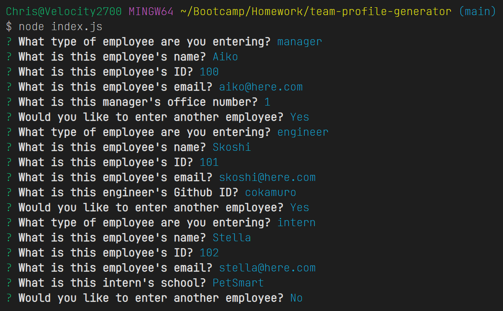
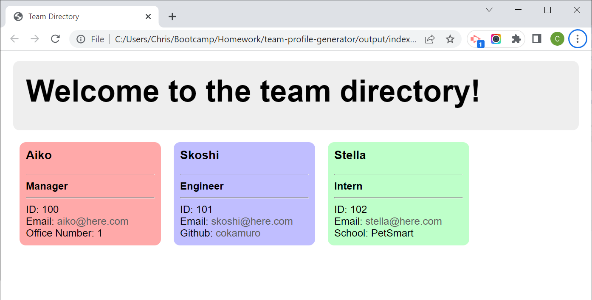
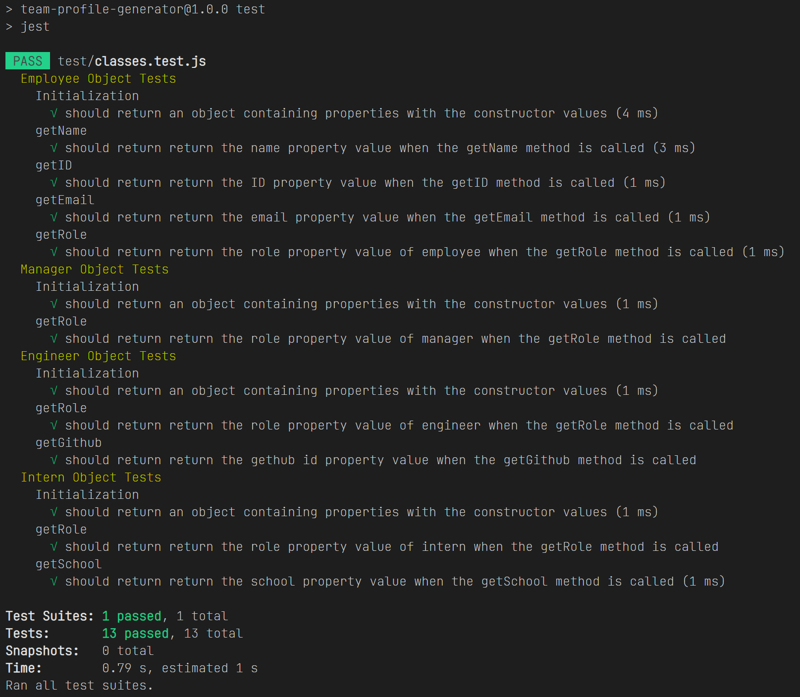

# 10 Object-Oriented Programming Challenge: Team Profile Generator

[Walkthrough Video](https://drive.google.com/file/d/1bY-ivtuS5TlcJ7VX8FTd4olityUgKYsJ/view)

## Table of Contents
- [Description](#description)
- [Visuals](#visuals)
- [Usage](#usage)

## Description
This is the solution JavaScript, HTML, and Jest unit test for the 02-Challenge assignment in the 10 OOP Module.

The purpose of the assignment was to create a company directory generator that takes user input via *Inquirer* module, and writes the HTML using the *fs* module.  The base Employee class is inherited into the Manager, Engineer, and Intern classes.  The first Inquirer prompt asks what type of employee is being added, while the subsequent prompts are static based on the properties of the Employee class, and dynamic, based on the properties of the appropriate superclass.  The entered data populates the appropiate object, and that object is pushed onto an object collection for dynamic renderingof employee cards.  This is then merged into an existing *index.html* file, and the composite contents are written to a new *index.html* file in the *output* directory.  

The Employee, Manager, Engineer, and Intern objects are all covered with *Jest* unit tests (located in *./test/classes.test.js*).

The lightweight CSS framework [Min](https://mincss.com/) was used for the page styling.

## Usage 
The program is invoked via node at the command prompt with no arguments as follows: _node index.js_

If Jest is present, the tests can be run at the command prompt as follows:  _npm test_

The program requires write/create access to the _output_ subdirectory

## Installation Instructions
The program requires *npm* installation of the inquirer and fs modules.  

Running the unit tests requires the *Jest* module.

## Visuals
### The site in operation

### Unit tests in operation

[Walkthrough Video (in case you didn't see it at the top of this document)](https://drive.google.com/file/d/1bY-ivtuS5TlcJ7VX8FTd4olityUgKYsJ/view)
